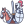
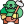
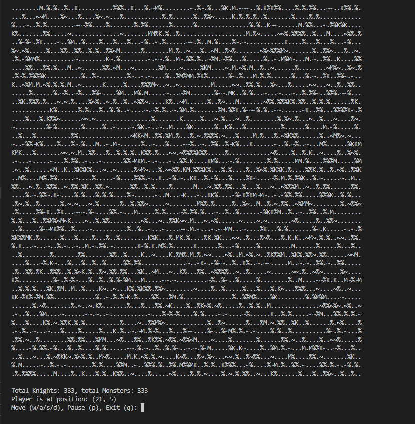
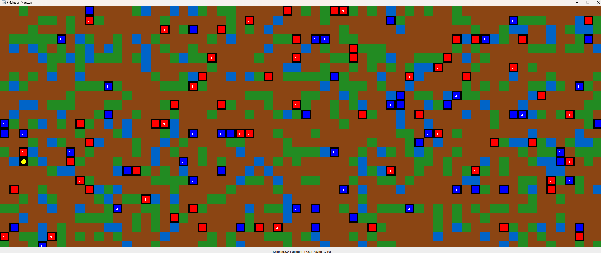

## Knights vs Monsters Java Game  

This project is a turn-based console game developed in Java. It simulates a dynamic battle bettwen two factions, the Knights and the Monsters, on an interactive map. The user-player controls a unique Avatar to observe the flow of the battle. 

This project is a University assignment focuses on demonstration core Object-Oriented Programming (OOP) principles through practical game development and offers the flexibility of both **console-based (Terminal)** and **graphical (Swing GUI) interfaces**.

### Assignment Goals and Demonstrated Concepts
This project aims to fulfill the following assignment requirements and showcases the application of several key OOP and Java concepts:

1. **Object-Oriented Design:** The game structure heavily relies on classes and objects to model different entities and game components.

2. **Inheritance Hierarchy:**
- Entity serves as the **abstract** base class for all game elements, defining common properties like coordinates, health, and a display symbol.
- Fighter extends Entity, introducing combat-specific attributes (attackPower, defense, medicine) and behavior for combatants.
- Knight and Monster are concrete classes derived from Fighter, each with unique movement patterns and combat roles.
- Player extends Entity, representing the user's controlled avatar with distinct properties (e.g., immunity).

3. **Polymorphism:** Evidenced by the move() method, where each Fighter subclass (Knight, Monster) implements its movement logic in a unique way, yet can be called universally.

4. **Encapsulation:** Data fields within classes are primarily private or protected, ensuring data integrity and access control through public getter and setter methods.

5. **Procedural Content Generation:** The Map class dynamically creates its terrain (., ~, %) and initial entity placement using random number generation.

6. **Game Loop & State Management:** The Game class manages the core loop, turn progression, user input, and game termination conditions.

7. **User Interface Implementation:** 
- <ins>Terminal Version</ins>: Utilizes java.util.Scanner for player input and System.out.print/println for rendering the game state.
- <ins>GUI Version (Swing)</ins>: Employs Java Swing for a graphical representation of the map and entities, with event listeners for input.

8. **Anonymous Inner Class:** The Map's getEntityAt() method is overridden using an anonymous inner class within Game.java to allow the map to query entity positions without direct knowledge of the Game's entity lists.

### Features
**1.** User generates dynamically a map. The game map is randomly generated with different terrain types:
- Earth (.) -> 70% of the map
- Trees (%) -> 20% of the map
- Water (~) -> 10% of the map

**2.** The game includes three entity types:
- Knights (K) -> Fighters that move randomly up, down, left, right
- Monsters (M) -> Fighters that move randomly up, down, left, right and diagonally
- Player (A) -> Avatar is controlled by the user moves up(w), down(s), left(a), right(d). 
It cannot attack or be attacked.

**3.** This game is a turn-based play. Each turn includes one entity's move.

**4.** Both Knights and Monsters move randomly within map boundaries, avoiding obstacles and other entities.

**5.** Fighters have health (starting at 3), attackPower (1-3) and defence (1-2). If opposing fighters are adjacent, they may attack based on their attackPower versus the opponent's attackPower. Damage calculation: attackPower of the attacker - defence of the defender. Defeated fighters (health drops to 0) are removed from the map.

**6.** Healing: Adjacent Fighters of the same team (e.g. Knight next to another Knight) can randomly offer medicine (0-2 initial units) to heal a wounded fellow entity.

**7.** Game End Conditions: The game terminates when either all Knights or all Monsters have been eliminated from the map.

**8.** Users dynamially can:
- Move their Avatar (w -> up, s -> down, a -> left, d -> right)
- Pause/Info or Unpause teh game: p -> to pause the game and display current info (Knights/Monsters count, total health for each faction). Press p again to upause the game.

**9.** Quit the game: q -> to exit the game at any time.

### File structure
- **Entity.java:** Abstract base class for all game objects.
- **Fighter.java:** Abstract class extending Entity for combat units.
- **Knight.java:** Concrete class extending Fighter (Knights).
- **Monster.java:** Concrete class extending Fighter (Monsters).
- **Player.java:** Concrete class extending Entity (Player avatar).
- **Map.java:** Manages the game world's terrain and entity positions.
- **Game.java:** Manages the game's logic, loop, and orchestration.
- **Main.java:** the main class of the project.

### Installation and Running guide
**1.** Clone the Repository:
create a folder to store the repository
```
cd <path>
git clone https://github.com/UOM-Department-of-Applied-Informatics/javaproject2025-AngelikiMt.git
```

**2.** Compile the source code:
```
javac *.java
```

**3.** Run the game:
```
java Main
```
**4.** Choose Your Game Mode:
- <ins>For Terminal Version</ins>: Enter 1 when prompted. The game will run entirely within your console.

- <ins>For GUI Version</ins>: Enter 2 when prompted. A Swing window will open, displaying the game graphically.


## Requirements
**1.** JDK 8+

**2.** Java 17+

